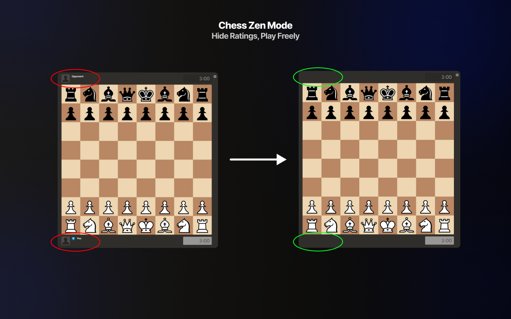
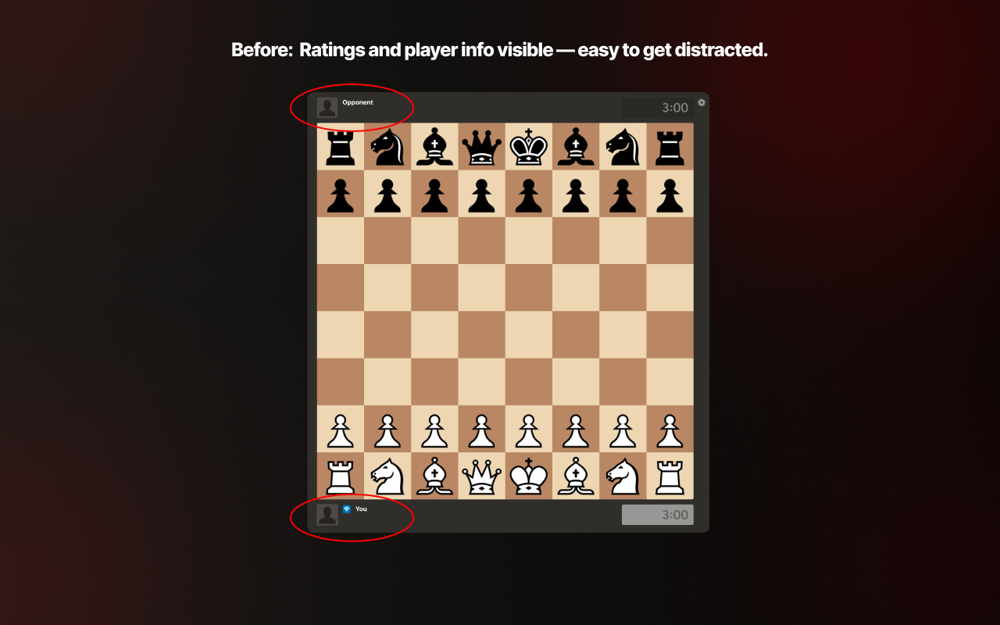
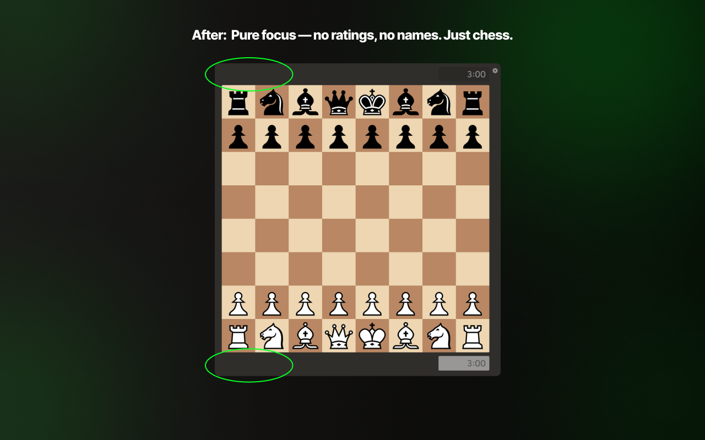

# Chess Zen Mode (Unofficial)

Hide ratings, names/usernames, and profile pictures on **Chess.com** so you can focus purely on the board.

*[Link to the Chrome Extension Store](https://chromewebstore.google.com/detail/chess-zen-mode/fnopdpaobdgfhjcbghjnidodgmjdbael)*

---

## What it does

- Hides **both players’ ratings**
- Hides **names/usernames**
- Replaces **avatars** with a neutral image
- Leaves clocks, moves list, and evaluation bar untouched

**Why install it?** Reduce rating anxiety and opponent bias; play calmer, more consistent chess.

---

## Screenshots

---

## Install

### Local (for development)
1. Clone this repo.
2. Go to **chrome://extensions**.
3. Toggle **Developer mode** on (top right).
4. Click **Load unpacked** and select the repo folder.

---

## Disclaimer

This is an independent, community-built tool and is not affiliated with or endorsed by Chess.com.

